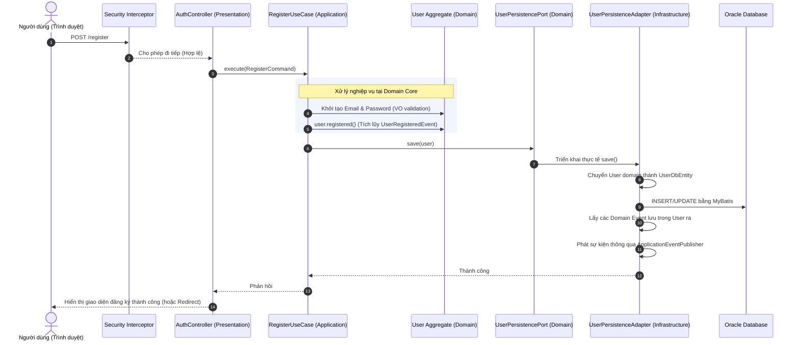
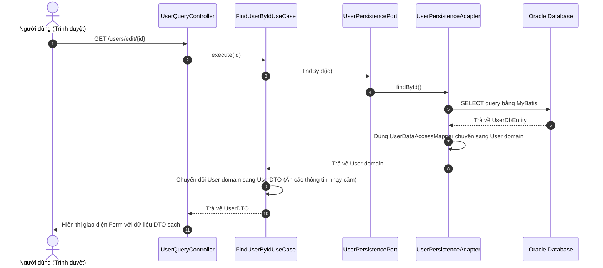

# Tài liệu Kiến trúc Hệ thống (Clean Architecture & CQRS)

Dự án này được thiết kế theo mô hình **Clean Architecture** kết hợp với **CQRS** (Command Query Responsibility Segregation) và các nguyên lý **DDD** (Domain-Driven Design). Dưới đây là mô tả chi tiết về chức năng, nhiệm vụ và luồng hoạt động của từng tầng trong hệ thống.

---

## 1. Tổng quan cấu trúc các tầng (Layers Structure)

Thứ tự phụ thuộc của các tầng đi từ ngoài vào trong: **Presentation/Infrastructure ──► Application ──► Domain**. Tầng bên trong không biết gì về sự tồn tại của tầng bên ngoài.

```
┌─────────────────────────────────────────────────────────────┐
│                 INFRASTRUCTURE / PRESENTATION               │
│  (Controllers, Security Interceptors, MyBatis, Adapters)    │
└──────────────────────────────┬──────────────────────────────┘
                               │ phụ thuộc
                               ▼
┌─────────────────────────────────────────────────────────────┐
│                         APPLICATION                         │
│  (Use Cases / Input Ports, Command & Query DTOs)            │
└──────────────────────────────┬──────────────────────────────┘
                               │ phụ thuộc
                               ▼
┌─────────────────────────────────────────────────────────────┐
│                           DOMAIN                            │
│  (Entities, Value Objects, Domain Events, Output Ports)     │
└─────────────────────────────────────────────────────────────┘
```

---

## 2. Chi tiết vai trò từng tầng

### A. Tầng Domain (Domain Layer)
Là phần lõi cốt lõi chứa các quy tắc nghiệp vụ quan trọng nhất của ứng dụng. Tầng này không phụ thuộc vào bất kỳ thư viện hay framework bên ngoài nào (như Spring, MyBatis).

*   **Entities (Aggregate Roots):** (ví dụ: `User.java`)
    *   Đại diện cho các thực thể mang bản sắc (identity) riêng biệt.
    *   Chứa trạng thái nghiệp vụ và các phương thức tự thay đổi trạng thái (ví dụ: `activate()`, `deactivate()`, `registered()`).
    *   Lưu trữ danh sách sự kiện nghiệp vụ (`domainEvents`).
*   **Value Objects (VOs):** (ví dụ: `Email.java`, `Password.java`)
    *   Là các thuộc tính bất biến (immutable), không có identity riêng.
    *   Tự xác thực tính hợp lệ của dữ liệu ngay khi khởi tạo (self-validation).
*   **Domain Events:** (ví dụ: `UserRegisteredEvent.java`)
    *   Đại diện cho một sự kiện nghiệp vụ quan trọng đã xảy ra trong quá khứ.
*   **Output Ports (Interfaces):** (ví dụ: `UserPersistencePort.java`)
    *   Các giao diện định nghĩa cách giao tiếp với các hệ thống bên ngoài (như lưu trữ dữ liệu). Tầng Domain chỉ định nghĩa cổng (port), phần triển khai thực tế (adapter) sẽ nằm ở tầng ngoài cùng.

---

### B. Tầng Application (Application Layer)
Đóng vai trò điều phối luồng nghiệp vụ của ứng dụng (Orchestrator). Tầng này nhận yêu cầu từ bên ngoài, lấy dữ liệu từ Domain Port, thực thi nghiệp vụ thông qua Domain Entities, sau đó lưu lại.

*   **Input Ports / Use Cases:** (ví dụ: `CreateUserUseCase.java`, `RegisterUseCase.java`)
    *   Thực hiện nghiệp vụ cụ thể cho từng ca sử dụng.
    *   Quản lý giao dịch (`@Transactional`).
*   **Commands & Queries DTOs:** (ví dụ: `CreateUserCommand.java`, `UserDTO.java`)
    *   `Command` đại diện cho yêu cầu thay đổi trạng thái hệ thống.
    *   `Query` đại diện cho yêu cầu đọc dữ liệu.
    *   `DTO` là cấu trúc dữ liệu trả về cho phía UI/API.

---

### C. Tầng Infrastructure / Presentation (Cơ sở hạ tầng & Hiển thị)
Chứa các thành phần phụ thuộc vào framework, thư viện bên ngoài và giao diện người dùng.

*   **Presentation (Controllers / JSP):** (ví dụ: `AuthController.java`, `UserController.java`)
    *   Nhận HTTP Request từ phía client, chuyển đổi tham số sang dạng Command/Query và gọi Use Case.
    *   Chọn giao diện JSP để render hoặc trả về mã trạng thái.
*   **Security & Interceptor:** (ví dụ: `SecurityInterceptor.java`)
    *   Xác thực người dùng và phân quyền truy cập endpoint trước khi request đi vào Controller.
*   **Persistence (MyBatis & Adapter):**
    *   `UserDbEntity.java`: Object ánh xạ trực tiếp 1-1 với bảng DB.
    *   `UserCommandMapper` & `UserQueryMapper`: Các interface MyBatis thực hiện truy vấn SQL.
    *   `UserDataAccessMapper.java`: Mapping qua lại giữa `UserDbEntity` và Domain Entity `User`.
    *   `UserPersistenceAdapter.java`: Implement cổng `UserPersistencePort`. Lớp này thực hiện ghi/đọc thực tế dưới DB và publish domain events.
*   **Event Listeners:** (ví dụ: `UserEventListener.java`)
    *   Lắng nghe các domain events được phát ra để thực hiện các tác vụ phụ (như gửi email, ghi log hệ thống).

---

## 3. Luồng hoạt động của hệ thống (Workflows)

### Luồng Ghi dữ liệu (Write / Command Flow)
Quy trình thực thi khi người dùng thực hiện một hành động làm thay đổi dữ liệu (ví dụ: đăng ký tài khoản):



---

### Luồng Đọc dữ liệu (Read / Query Flow)
Quy trình thực thi khi người dùng xem danh sách hoặc tìm kiếm thông tin:



---

## 4. Luồng xử lý sự kiện bất đồng bộ (Domain Event Handling Flow)

Khi một sự kiện như `UserRegisteredEvent` được phát đi từ `UserPersistenceAdapter`:

```
[UserPersistenceAdapter] (Phát sự kiện)
          │
          ▼
 [Spring ApplicationEventPublisher] (Phân phối sự kiện)
          │
          ▼
   [UserEventListener] (Lắng nghe sự kiện)
          │
      ┌───┴───────────────┐
      ▼                   ▼
[Ghi Log hệ thống]    [Gửi Email chào mừng] (Simulated)
```
*Tách sự kiện này giúp tầng đăng ký người dùng hoạt động rất nhanh và không bị nghẽn bởi các tác vụ phụ như gửi mail hay thông báo bên thứ 3.*
