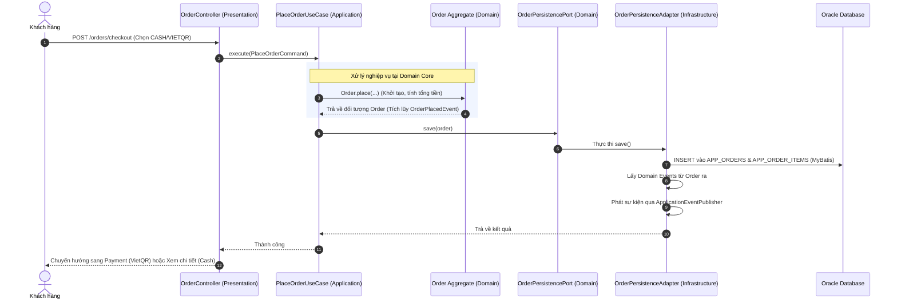
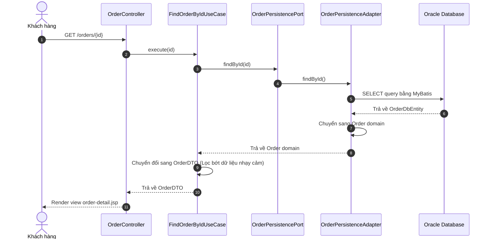

# Tài liệu Kiến trúc Hệ thống (Clean Architecture, DDD & CQRS)

Dự án này được thiết kế theo mô hình **Clean Architecture** kết hợp với **CQRS** (Command Query Responsibility Segregation) và các nguyên lý **DDD** (Domain-Driven Design). Dưới đây là mô tả chi tiết về chức năng, nhiệm vụ, các dịch vụ bên thứ ba (Third-party Services) và luồng hoạt động của từng tầng trong hệ thống.

---

## 1. Tổng quan cấu trúc các tầng (Layers Structure)

Thứ tự phụ thuộc của các tầng đi từ ngoài vào trong: **Presentation/Infrastructure ──► Application ──► Domain**. Tầng bên trong không biết gì về sự tồn tại của tầng bên ngoài.

```
┌─────────────────────────────────────────────────────────────┐
│                 INFRASTRUCTURE / PRESENTATION               │
│  (Controllers, Security Interceptors, MyBatis, Adapters)    │
└──────────────────────────────┬──────────────────────────────┘
                               │ phụ thuộc
                               ▼
┌─────────────────────────────────────────────────────────────┐
│                         APPLICATION                         │
│  (Use Cases / Input Ports, Command & Query DTOs)            │
└──────────────────────────────┬──────────────────────────────┘
                               │ phụ thuộc
                               ▼
┌─────────────────────────────────────────────────────────────┐
│                           DOMAIN                            │
│  (Entities, Value Objects, Domain Events, Output Ports)     │
└─────────────────────────────────────────────────────────────┘
```

---

## 2. Chi tiết vai trò từng tầng

### A. Tầng Domain (Domain Layer)
Là phần lõi cốt lõi chứa các quy tắc nghiệp vụ quan trọng nhất của ứng dụng. Tầng này không phụ thuộc vào bất kỳ thư viện hay framework bên ngoài nào (như Spring, MyBatis).

*   **Entities (Aggregate Roots):** (ví dụ: `User.java`, `Order.java`)
    *   Đại diện cho các thực thể mang bản sắc (identity) riêng biệt.
    *   Chứa trạng thái nghiệp vụ và các phương thức tự thay đổi trạng thái (ví dụ: `activate()`, `confirm()`, `deliver()`).
    *   Lưu trữ danh sách sự kiện nghiệp vụ (`domainEvents`).
*   **Value Objects (VOs):** (ví dụ: `Email.java`, `Password.java`, `ShippingAddress.java`)
    *   Là các thuộc tính bất biến (immutable), không có identity riêng.
    *   Tự xác thực tính hợp lệ của dữ liệu ngay khi khởi tạo (self-validation).
*   **Domain Events:** (ví dụ: `UserRegisteredEvent.java`, `OrderPlacedEvent.java`)
    *   Đại diện cho một sự kiện nghiệp vụ quan trọng đã xảy ra trong quá khứ.
*   **Output Ports (Interfaces):** (ví dụ: `UserPersistencePort.java`, `NotificationPort.java`, `ImageStoragePort.java`)
    *   Các giao diện định nghĩa cách giao tiếp với các hệ thống bên ngoài. Tầng Domain chỉ định nghĩa cổng (port), phần triển khai thực tế (adapter) sẽ nằm ở tầng ngoài cùng.

---

### B. Tầng Application (Application Layer)
Đóng vai trò điều phối luồng nghiệp vụ của ứng dụng (Orchestrator). Tầng này nhận yêu cầu từ bên ngoài, lấy dữ liệu từ Domain Port, thực thi nghiệp vụ thông qua Domain Entities, sau đó lưu lại.

*   **Input Ports / Use Cases:** (ví dụ: `CreateUserUseCase.java`, `PlaceOrderUseCase.java`)
    *   Thực hiện nghiệp vụ cụ thể cho từng ca sử dụng.
    *   Quản lý giao dịch (`@Transactional`).
*   **Commands & Queries DTOs:** (ví dụ: `PlaceOrderCommand.java`, `OrderDTO.java`)
    *   `Command` đại diện cho yêu cầu thay đổi trạng thái hệ thống.
    *   `Query` đại diện cho yêu cầu đọc dữ liệu.
    *   `DTO` là cấu trúc dữ liệu trả về cho phía UI/API.

---

### C. Tầng Infrastructure / Presentation (Cơ sở hạ tầng & Hiển thị)
Chứa các thành phần phụ thuộc vào framework, thư viện bên ngoài và giao diện người dùng.

*   **Presentation (Controllers / JSP):** (ví dụ: `OrderController.java`, `checkout.jsp`)
    *   Nhận HTTP Request từ phía client, chuyển đổi tham số sang dạng Command/Query và gọi Use Case.
*   **Persistence (MyBatis & Adapter):**
    *   `OrderDbEntity.java`: Object ánh xạ trực tiếp 1-1 với bảng DB.
    *   `OrderPersistenceAdapter.java`: Triển khai cổng `OrderPersistencePort`.
*   **Event Listeners:** (ví dụ: `OrderEventListener.java`)
    *   Lắng nghe các domain events được phát ra để thực hiện các tác vụ phụ (như gửi email, ghi log hệ thống).

---

## 3. Tích hợp Dịch vụ Bên Thứ Ba (Third-Party Services Integration)

Để tránh sự phụ thuộc chặt chẽ (tight coupling) vào các dịch vụ bên ngoài, dự án áp dụng mô hình **Ports & Adapters** đóng vai trò là một **Anti-Corruption Layer (ACL - Lớp chống mục nát)**. Domain Layer chỉ giao tiếp qua Port (Interface), còn cấu hình và SDK của dịch vụ bên thứ ba được cô lập hoàn toàn ở tầng Infrastructure.

```
                  ┌────────────────────────────────────────┐
                  │              DOMAIN LAYER              │
                  │  - ImageStoragePort (Interface)        │
                  │  - NotificationPort (Interface)        │
                  └───────────────────┬────────────────────┘
                                      │
                         ┌────────────┴────────────┐
                         ▼ (Implement / Adapter)   ▼
    ┌──────────────────────────────────┐   ┌──────────────────────────────────┐
    │       INFRASTRUCTURE LAYER       │   │       INFRASTRUCTURE LAYER       │
    │  - CloudinaryImageStorageAdapter │   │  - JavaMailNotificationAdapter   │
    │  - Sử dụng SDK Cloudinary        │   │  - Sử dụng JavaMailSender (SMTP) │
    └────────────────┬─────────────────┘   └────────────────┬─────────────────┘
                     │ REST API                             │ SMTP Protocol
                     ▼                                      ▼
             ┌───────────────┐                      ┌───────────────┐
             │  Cloudinary   │                      │  SMTP Server  │
             │ (Image Cloud) │                      │    (Gmail)    │
             └───────────────┘                      └───────────────┘
```

### 3.1. Dịch vụ lưu trữ hình ảnh Cloudinary (Image Hosting)
* **Mục đích**: Lưu trữ và quản lý hình ảnh sản phẩm trong Catalog.
* **Cổng giao tiếp (Port)**: `ImageStoragePort.java` (Domain Layer).
* **Triển khai (Adapter)**: `CloudinaryImageStorageAdapter.java` (Infrastructure Layer).
* **Cấu hình**: Thông tin kết nối được quản lý thông qua cấu hình `CloudinaryConfig.java` nạp từ `application-local.properties`:
  * `cloudinary.cloud-name`: Tên tài khoản Cloudinary.
  * `cloudinary.api-key`: API Key xác thực.
  * `cloudinary.api-secret`: Khóa bí mật.

### 3.2. Dịch vụ gửi thư điện tử SMTP (Mail Sender)
* **Mục đích**: Gửi các email thông báo giao dịch (Đặt hàng thành công, Xác nhận thanh toán, Giao hàng thành công) tới người dùng.
* **Cổng giao tiếp (Port)**: `NotificationPort.java` (Domain Layer).
* **Triển khai (Adapter)**: `JavaMailNotificationAdapter.java` (Infrastructure Layer).
* **Cấu hình**: Nạp cấu hình thông qua `MailConfig.java` cấu hình SMTP Gmail/Outlook:
  * `mail.host` & `mail.port`: Địa chỉ máy chủ (ví dụ: `smtp.gmail.com:587`).
  * `mail.username` & `mail.password`: Tài khoản và Mật khẩu ứng dụng (App Password).

### 3.3. Dịch vụ Thanh toán VietQR (VietQR Dynamic Code)
* **Mục đích**: Tạo mã QR động tự động điền số tài khoản, số tiền và nội dung chuyển khoản cho đơn hàng.
* **Cách hoạt động**: Tích hợp trực tiếp tại tầng View bằng cách sinh URL động hướng tới Public API của VietQR (`img.vietqr.io`). Không cần cài đặt SDK bên thứ ba, tối ưu tốc độ phản hồi.
* **Cấu hình**:
  * `vietqr.bank-code`: Mã ngân hàng nhận (ví dụ: `MB`, `VCB`).
  * `vietqr.account-number`: Số tài khoản thụ hưởng.
  * `vietqr.account-name`: Tên chủ tài khoản (tiếng Việt không dấu).

---

## 4. Luồng hoạt động của hệ thống (Workflows)

### Luồng Ghi dữ liệu (Write / Command Flow)
Quy trình thực thi khi người dùng đặt hàng mới:



---

### Luồng Đọc dữ liệu (Read / Query Flow)
Quy trình thực thi khi người dùng xem chi tiết đơn hàng:



---

## 5. Luồng xử lý sự kiện bất đồng bộ (Domain Event Handling Flow)

Khi đơn hàng được lưu thành công, các side-effect được kích hoạt thông qua sự kiện miền:

```
[OrderPersistenceAdapter] (Phát sự kiện)
          │
          ▼
 [Spring ApplicationEventPublisher] (Phân phối sự kiện)
          │
          ▼
   [OrderEventListener] (Lắng nghe sự kiện)
          │
          ▼
   ┌──────┴──────────────┐
   ▼                     ▼
[Ghi Log hệ thống]   [Gửi Email xác nhận qua SMTP]
                     (NotificationPort -> JavaMailNotificationAdapter)
```

**Ưu điểm**: Phân tách luồng xử lý chính (tạo đơn hàng) và luồng phụ (gửi mail). Nếu hệ thống gửi mail gặp sự cố, đơn hàng của khách hàng vẫn được tạo thành công bình thường.
