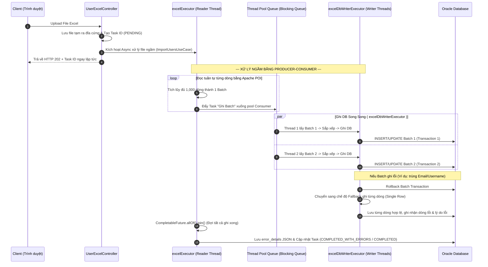
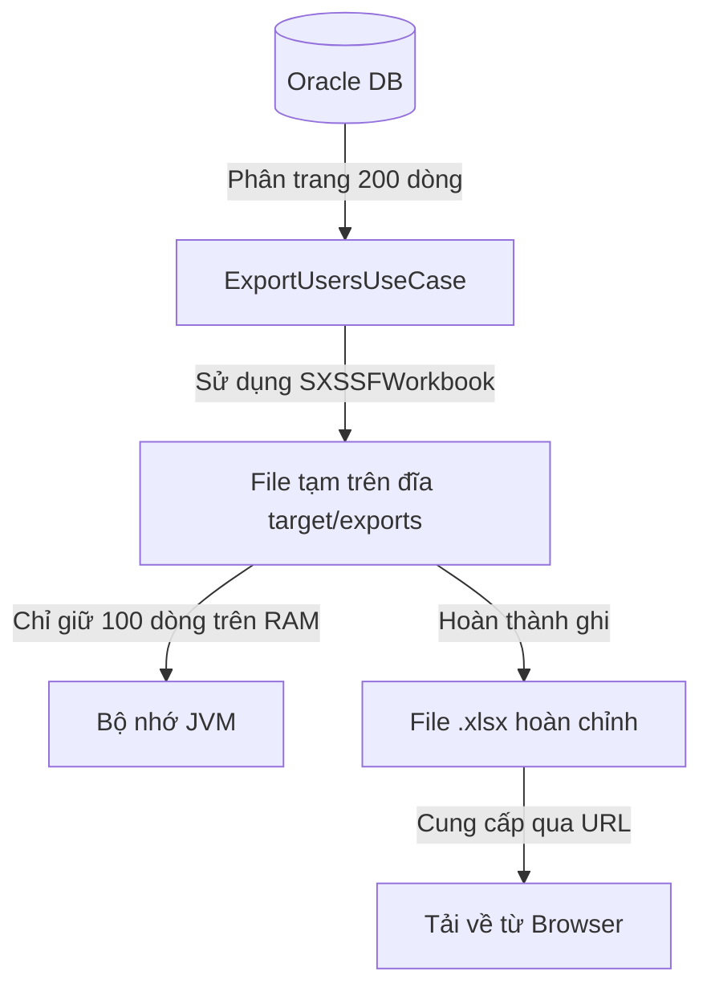

# Báo cáo Kỹ thuật: Áp dụng Multi-threading trong xử lý Import/Export Excel (Spring MVC)

Tài liệu này trình bày thiết kế kiến trúc, cấu hình Thread Pool và các mẫu code tối ưu thực tế đã được triển khai để xử lý nhập/xuất dữ liệu người dùng (Import/Export) quy mô lớn (hỗ trợ tới 10.000 dòng) một cách bất đồng bộ, an toàn và hiệu năng cao trong dự án Spring MVC.

---

## 1. Tại sao cần Đa luồng (Multi-threading) cho Excel?

Khi kích thước tệp Excel tăng từ hàng nghìn lên hàng triệu dòng, việc xử lý đồng bộ trên luồng HTTP (HTTP Request Thread) sẽ gây ra các lỗi nghiêm trọng:
1. **Gateway Timeout (504):** Luồng HTTP bị khóa quá lâu chờ đọc/ghi DB và mạng, khiến web server ngắt kết nối.
2. **Treo giao diện (Poor UX):** Người dùng phải chờ màn hình loading xoay vòng vĩnh viễn và không thể thực hiện thao tác khác.
3. **OutOfMemoryError (OOM):** Load toàn bộ file Excel vào bộ nhớ JVM làm tràn RAM của Server.

---

## 2. Thiết kế Kiến trúc Thread Pool

Chúng ta áp dụng giải pháp **Tách biệt tài nguyên (Thread Isolation)** bằng cách cấu hình 2 Thread Pool riêng biệt trong lớp cấu hình của dự án:

* **File cấu hình**: `src/main/java/com/examp/springmvc/shared/infrastructure/config/AsyncConfig.java`

| Tên Thread Pool | Vai trò | Core Size | Max Size | Queue Capacity | Rejected Policy | Thread Prefix |
| :--- | :--- | :---: | :---: | :---: | :--- | :--- |
| **`excelExecutor`** | **Producer**: Nhận yêu cầu, đọc file Excel ngầm tuần tự và chia lô (Batching). | 2 | 4 | 20 | CallerRunsPolicy | `ExcelReader-` |
| **`excelDbWriterExecutor`** | **Consumer**: Nhận các lô dữ liệu được chia và thực hiện ghi xuống DB song song. | 5 | 10 | 500 | CallerRunsPolicy | `ExcelDbWriter-` |

---

## 3. Nghiệp vụ Import Excel (Nhập dữ liệu người dùng) - Mô hình Producer-Consumer

Để tối ưu hóa tài nguyên, chúng ta kết hợp **Đơn luồng đọc (Streaming Parser)** và **Đa luồng ghi Database song song** kèm cơ chế rollback cô lập lỗi.

* **File triển khai**: `src/main/java/com/examp/springmvc/user/application/usermanagement/command/ImportUsersUseCase.java`
* **Hàm thực thi chính**: `public void execute(ImportUsersCommand command)` (Được đánh dấu `@Async("excelExecutor")` để chạy ngầm).



### Các kỹ thuật tối ưu trong Import:
1. **Phòng tránh Deadlock trên Database**:
   Trước khi đẩy batch xuống DB, dữ liệu được sắp xếp theo `username` tăng dần:
   ```java
   batch.sort(Comparator.comparing(UserImportRow::getUsername));
   ```
   Điều này đảm bảo mọi thread song song luôn tranh chấp khóa (lock) theo cùng một thứ tự nhất quán, triệt tiêu nguy cơ xảy ra deadlock trong Oracle DB.
2. **Quản lý giao dịch cục bộ**:
   Mỗi batch được chạy trong một transaction độc lập qua `PlatformTransactionManager` và `TransactionTemplate` để giải phóng kết nối DB nhanh nhất có thể.
3. **Cơ chế Fallback thông minh**:
   Khi lưu cả batch bị thất bại (do trùng lặp dữ liệu do luồng chạy trước vừa ghi), hệ thống thực hiện rollback transaction của batch đó và tự động chuyển sang lưu **từng dòng đơn lẻ (single-row processing)**. Kỹ thuật này giúp hệ thống lưu thành công tối đa các dòng hợp lệ khác và chỉ loại bỏ các dòng bị lỗi.
4. **Ghi log lỗi chuẩn hóa**:
   Chi tiết dòng lỗi, thông tin người dùng và lý do lỗi được thu thập an toàn qua luồng (`ConcurrentLinkedQueue`) và lưu vào trường `ERROR_DETAILS` trong DB dưới dạng JSON.

---

## 4. Nghiệp vụ Export Excel (Xuất dữ liệu người dùng) - Streaming POI

Đối với tác vụ Xuất dữ liệu (Export), thư viện ghi file Excel không an toàn về luồng (non-thread-safe). Giải pháp tối ưu là sử dụng **1 luồng ngầm ghi tuần tự bằng Streaming API**.

* **File triển khai**: `src/main/java/com/examp/springmvc/user/application/usermanagement/query/ExportUsersUseCase.java`
* **Hàm thực thi chính**: `public void execute(ExportUsersCommand command)` (Được đánh dấu `@Async("excelExecutor")`).



### Các kỹ thuật tối ưu trong Export:
1. **Sử dụng `SXSSFWorkbook` (Streaming POI)**:
   Khởi tạo workbook với `new SXSSFWorkbook(100)`. Cấu hình này giới hạn bộ nhớ đệm RAM tối đa chỉ chứa 100 dòng dữ liệu. Khi số dòng vượt quá 100, POI tự động nén và ghi (flush) dữ liệu xuống file tạm trên đĩa đệm, giữ cho lượng RAM tiêu thụ của ứng dụng luôn ở mức cực thấp, ngăn ngừa hoàn toàn lỗi OutOfMemoryError (OOM).
2. **Cập nhật tiến trình thời gian thực**:
   Hệ thống cập nhật tiến độ mỗi khi xuất thành công 200 dòng để Client cập nhật dashboard giao diện.
3. **Giải phóng đĩa đệm**:
   Ngay sau khi xuất thành công và lưu file, gọi `workbook.dispose()` để xóa toàn bộ các tệp XML đệm tạm thời trên đĩa cứng hệ điều hành.

---

## 5. REST API & Controller điều phối

Controller đóng vai trò tiếp nhận yêu cầu từ client, khởi tạo Task ID giám sát ngay lập tức và quản lý file tạm.

* **File triển khai**: `src/main/java/com/examp/springmvc/user/presentation/UserExcelController.java`

### Các API chính:
* `POST /users/excel/import`: Nhận file upload (`MultipartFile`), lưu file tạm trên server, tạo Task ID, kích hoạt `ImportUsersUseCase` ngầm và trả về HTTP 202 kèm `taskId` ngay lập tức.
* `POST /users/excel/export`: Tạo Task ID, kích hoạt `ExportUsersUseCase` ngầm và trả về HTTP 202 kèm `taskId`.
* `GET /users/excel/tasks`: API polling cho client truy vấn danh sách 5 task gần nhất (trả về trạng thái, tiến độ %, số dòng thành công/thất bại).
* `GET /users/excel/download/{taskId}`: Tải xuống file Excel đã kết xuất thành công.
* `GET /users/excel/errors/{taskId}`: Tải file log báo cáo lỗi chi tiết dạng Text đối với các dòng bị hỏng khi import.

---

## 6. Giao diện Giám sát Tiến trình (UI/UX Dashboard)

Hệ thống cung cấp dashboard giám sát thời gian thực giúp quản trị viên theo dõi tiến trình đa luồng chạy ngầm trực quan.

* **Trang JSP**: `src/main/webapp/WEB-INF/views/user/list.jsp`
  * Tích hợp khối HTML dashboard, thanh tiến trình (progress-bar) động và modal quản lý upload file.
* **JavaScript**: `src/main/webapp/resources/js/pages/user-list.js`
  * Tự động đính kèm Token CSRF vào các yêu cầu AJAX gửi đi.
  * Thiết lập polling định kỳ mỗi 1.5 giây một lần gửi request tới `/users/excel/tasks`.
  * Cập nhật giao diện động: tăng giảm thanh tiến trình %, thay đổi nhãn trạng thái (`Đang xử lý`, `Hoàn thành`, `Hoàn thành có lỗi`, `Thất bại`) và hiển thị nút **Xem lỗi** đối với các task có dòng lỗi.

---

## 7. Giải pháp phòng tránh Race Condition và Vị trí triển khai

Trong hệ thống xử lý Excel đa luồng, việc nhiều luồng chạy song song truy cập vào tài nguyên chung (như trạng thái Task, ghi dữ liệu vào Database) rất dễ gây ra race condition hoặc deadlock. Dưới đây là các giải pháp được áp dụng và vị trí triển khai cụ thể:

### 7.1. Sử dụng các Thao tác Nguyên tử (Atomic Operations)
* **Giải pháp**: Sử dụng các lớp Thread-safe như `AtomicInteger` để cập nhật tổng số dòng thành công/thất bại và `ConcurrentLinkedQueue` để ghi nhận nhật ký lỗi mà không cần dùng đến khối đồng bộ hóa `synchronized` gây chậm luồng.
* **Vị trí triển khai**:
  * **File**: `src/main/java/com/examp/springmvc/user/application/usermanagement/command/ImportUsersUseCase.java`
  * **Hàm**: `execute(ImportUsersCommand command)` & `processBatchAsync(...)`
  * **Chi tiết code**:
    * Khởi tạo: `AtomicInteger successCount = new AtomicInteger(0);` và `AtomicInteger failedCount = new AtomicInteger(0);`
    * Cập nhật tiến độ: `successCount.addAndGet(batchSuccess);`
    * Thu thập log lỗi song song: `ConcurrentLinkedQueue<UserImportRow> failedRowDetails = new ConcurrentLinkedQueue<>();`

### 7.2. Sắp xếp thứ tự khóa để tránh Deadlock (Consistent Locking Order)
* **Giải pháp**: Khi nhiều luồng cùng insert/update các bản ghi trong DB, deadlock có thể xảy ra nếu các luồng tranh chấp khóa hàng dọc theo các thứ tự trái ngược nhau. Giải pháp là sắp xếp danh sách dữ liệu trong mỗi batch theo thứ tự bảng chữ cái của `username` trước khi đẩy xuống tầng DB.
* **Vị trí triển khai**:
  * **File**: `src/main/java/com/examp/springmvc/user/application/usermanagement/command/ImportUsersUseCase.java`
  * **Hàm**: `processBatchAsync(...)`
  * **Chi tiết code**:
    ```java
    batch.sort(Comparator.comparing(UserImportRow::getUsername));
    ```

### 7.3. Message Passing & Cô lập tài nguyên (Mô hình Producer-Consumer)
* **Giải pháp**: Tách biệt hoàn toàn luồng đọc Excel (Producer) và luồng ghi DB (Consumer) thông qua hàng đợi công việc (Blocking Queue) của Thread Pool. Luồng đọc chỉ gửi các lô dữ liệu (Batch) đóng gói như các thông điệp độc lập, luồng ghi nhận lô và xử lý trong phạm vi bộ nhớ của riêng nó, hạn chế dùng chung trạng thái biến đổi (shared mutable state).
* **Vị trí triển khai**:
  * **File cấu hình**: `src/main/java/com/examp/springmvc/shared/infrastructure/config/AsyncConfig.java` (Cấu hình `excelExecutor` và `excelDbWriterExecutor`).
  * **File xử lý**: `src/main/java/com/examp/springmvc/user/application/usermanagement/command/ImportUsersUseCase.java` (Sử dụng `excelDbWriterExecutor` để đẩy tác vụ ghi DB ngầm chạy song song).

### 7.4. Cô lập giao dịch (Database Transaction Isolation)
* **Giải pháp**: Mỗi lô dữ liệu (Batch) được cam kết trong một Transaction cục bộ độc lập. Sử dụng cơ chế Spring Transaction Management để cô lập dữ liệu đang ghi của các lô khác nhau, đảm bảo dữ liệu ghi thành công từng phần ngay cả khi có lô khác bị lỗi và rollback.
* **Vị trí triển khai**:
  * **File**: `src/main/java/com/examp/springmvc/user/application/usermanagement/command/ImportUsersUseCase.java`
  * **Hàm**: `processBatchAsync(...)` & `saveSingleRow(...)`
  * **Chi tiết code**: Sử dụng `PlatformTransactionManager` và `TransactionTemplate` để khoanh vùng Transaction cục bộ mở/đóng cực nhanh.

---

## 8. Quy tắc vàng phòng chống lỗi trong Production

1. **Phòng chống Memory Leak (Rò rỉ bộ nhớ):** Bắt buộc gọi `workbook.dispose()` ở khối lệnh `finally` hoặc sau khi hoàn tất ghi với `SXSSFWorkbook` để xóa sạch các tệp XML rác sinh ra trong thư mục tạm hệ điều hành.
2. **Tránh nghẽn DB Connection Pool:** Tuyệt đối không đặt `@Transactional` ở mức phương thức `@Async` chạy ngầm. Chỉ dùng `@Transactional` ở các Transaction cục bộ trong Service con thực hiện ghi theo từng lô (Batch), giữ kết nối DB mở ngắn nhất có thể.
3. **Thao tác Thread-Safe với Tiến độ (Progress):** Để tính toán tiến độ trên các luồng song song chạy ngầm, bắt buộc phải sử dụng các lớp an toàn như `AtomicInteger` hoặc `ConcurrentLinkedQueue` để tránh hiện tượng mất mát dữ liệu do race condition.
4. **Consistent Locking Order:** Luôn sắp xếp danh sách các đối tượng theo một khóa chính duy nhất (như `username`, `id`) trước khi tiến hành cập nhật hàng loạt dưới DB để triệt tiêu nguy cơ deadlock.

