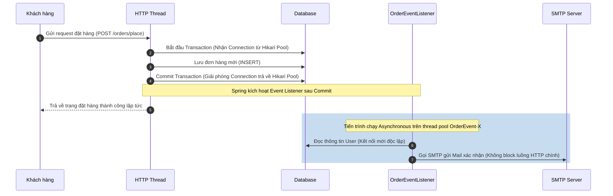

# Báo cáo Cải tiến Kiến trúc: Tái cấu trúc Tầng Infrastructure & Tối ưu hóa Xử lý Bất đồng bộ

Báo cáo này tài liệu hóa quá trình phân tích, lên kế hoạch và triển khai việc tái cấu trúc tầng **Infrastructure (Event Listening, Config & Persistence)** nhằm giải quyết lỗi thiết kế nghiêm trọng (`[Critical/High]`) liên quan đến xử lý sự kiện đồng bộ và hiệu năng truy vấn dữ liệu (N+1 query).

---

## 1. Tổng quan Vấn đề và Rủi ro Hệ thống

### 1.1. Sự kiện Đồng bộ trong Giao dịch (Synchronous Event Listener)
* **Vấn đề**: Lớp `OrderEventListener.java` trước đây lắng nghe các sự kiện miền (như `OrderPlacedEvent`, `OrderPaidEvent`) một cách đồng bộ thông qua annotation `@EventListener` mặc định.
* **Cơ chế**: Do sự kiện được phát đi (`publishEvent`) ngay từ bên trong phương thức được đánh dấu `@Transactional` ở tầng nghiệp vụ/persistence, toàn bộ tiến trình lắng nghe sự kiện đều chạy trên cùng luồng xử lý HTTP và cùng phạm vi giao dịch cơ sở dữ liệu.
* **Hậu quả**: 
  - **Tắc nghẽn Connection Pool (Database Starvation)**: Gửi mail xác nhận qua mạng (SMTP) tốn nhiều thời gian (1-5s) làm block luồng xử lý và giữ chặt connection DB trong Hikari Pool, gây treo hệ thống dưới tải lớn.
  - **Không nhất quán dữ liệu**: Mail được gửi trước khi transaction commit, dẫn đến việc rollback DB nhưng khách hàng vẫn nhận được mail đặt hàng/thanh toán thành công.

### 1.2. Lỗi N+1 Query trong OrderPersistenceAdapter
* **Vấn đề**: Trong phương thức `findByUserId(Long userId)` và `findAll()` của `OrderPersistenceAdapter.java`, mã nguồn thực hiện truy vấn lấy danh sách thực thể `OrderDbEntity` từ Database (1 câu lệnh SQL), sau đó dùng vòng lặp Java để truy vấn chi tiết các `OrderItemDbEntity` cho từng đơn hàng một (N câu lệnh SQL).
* **Hậu quả**: Khi truy vấn danh sách đơn hàng lớn (ví dụ N = 100 đơn hàng), hệ thống sẽ bắn ra **101 câu lệnh SQL** liên tục tới Database, gây giảm sút hiệu năng cực kỳ nghiêm trọng và lãng phí băng thông mạng/CPU.

---

## 2. Thiết kế mới & Giải pháp Kỹ thuật

### 2.1. Kích hoạt Bất đồng bộ với Thread Pool độc lập
* Khai báo `@EnableAsync` trên lớp cấu hình chính của ứng dụng và định nghĩa một Bean `ThreadPoolTaskExecutor` (tên: `taskExecutor`) để kiểm soát tài nguyên luồng hoạt động song song.

### 2.2. Transaction-Bound Event Listener
* Chuyển đổi từ `@EventListener` mặc định sang `@TransactionalEventListener(phase = TransactionPhase.AFTER_COMMIT)`. Đảm bảo listener chỉ chạy khi giao dịch cơ sở dữ liệu chính đã commit thành công.

### 2.3. Chuyển tác vụ gửi Email sang luồng mới
* Đánh dấu `@Async("taskExecutor")` trên các phương thức xử lý sự kiện trong `OrderEventListener.java` để đẩy công việc gửi email sang luồng phụ, giải phóng hoàn toàn luồng HTTP chính.

### 2.4. Khắc phục N+1 Query bằng LEFT JOIN & Collection ResultMap
* Thay vì chạy truy vấn riêng rẽ, chúng tôi chuyển sang sử dụng duy nhất **1 câu lệnh SQL với cú pháp LEFT JOIN** kết hợp bảng `APP_ORDERS` và `APP_ORDER_ITEMS` theo cột `ORDER_ID`.
* Ánh xạ kết quả thông qua cấu trúc `<collection>` của MyBatis ResultMap để tự động nhóm các chi tiết đơn hàng (Order Items) vào thuộc tính `List<OrderItemDbEntity> items` của thực thể đơn hàng cha (`OrderDbEntity`) trong 1 lần thực thi duy nhất.

---

## 3. Chi tiết các File thay đổi & Khởi tạo

### 3.1. Cấu hình hệ thống (Config Context)
* **[MODIFY] [RootConfig.java](../../src/main/java/com/examp/springmvc/shared/infrastructure/config/RootConfig.java):**
  - Kích hoạt tính năng xử lý bất đồng bộ `@EnableAsync`.
  - Cấu hình một thread pool có tên là `taskExecutor` với cấu hình giới hạn tài nguyên:
    - Core Pool Size: `5`
    - Max Pool Size: `10`
    - Queue Capacity: `25`
    - Thread Name Prefix: `OrderEvent-`

### 3.2. Quản lý Sự kiện Đơn hàng (Order Event Handler)
* **[MODIFY] [OrderEventListener.java](../../src/main/java/com/examp/springmvc/order/infrastructure/event/OrderEventListener.java):**
  - Áp dụng các cặp annotation `@TransactionalEventListener(phase = TransactionPhase.AFTER_COMMIT)` và `@Async("taskExecutor")` cho toàn bộ các handler: `onOrderPlaced`, `onOrderCancelled`, `onOrderStatusChanged`, và `onOrderPaid`.

### 3.3. Tối ưu hóa Truy vấn Đơn hàng (Order Context Persistence)
* **[MODIFY] [OrderDbEntity.java](../../src/main/java/com/examp/springmvc/order/infrastructure/persistence/OrderDbEntity.java):**
  - Khai báo thuộc tính `List<OrderItemDbEntity> items` và getter/setter tương ứng để hứng dữ liệu join từ MyBatis.
* **[MODIFY] [OrderMapper.xml](../../src/main/resources/mapper/OrderMapper.xml):**
  - Định nghĩa `OrderWithItemsResultMap` để map cấu trúc cha-con (Order và items).
  - Viết lại câu lệnh SQL của `findById`, `findByUserId`, và `findAll` thành phép `LEFT JOIN` với bảng `APP_ORDER_ITEMS`, bí danh hóa cột `o.ID AS ORDER_ID` và `i.ID AS ITEM_ID` để tránh xung đột cột.
* **[MODIFY] [OrderPersistenceAdapter.java](../../src/main/java/com/examp/springmvc/order/infrastructure/persistence/OrderPersistenceAdapter.java):**
  - Cập nhật `findById`, `findByUserId`, và `findAll` lấy danh sách chi tiết đơn hàng trực tiếp từ `entity.getItems()`, loại bỏ hoàn toàn các dòng lệnh gọi lặp `orderItemMapper.findByOrderId(...)`.
  - Nâng cấp phương thức map `toDomain()` để lọc và bỏ qua các bản ghi item null sinh ra bởi phép LEFT JOIN khi đơn hàng không có chi tiết (đảm bảo tính toàn vẹn dữ liệu).

---

## 4. Kết quả Xác thực & Đánh giá Chất lượng

1. **Spotless Code Format (`mvn spotless:apply`):**
   * Đạt trạng thái **SUCCESS**. Các file thay đổi tuân thủ nghiêm ngặt chuẩn định dạng code của dự án.
2. **Checkstyle (`mvn checkstyle:check`):**
   * Đạt trạng thái **SUCCESS** với **0 lỗi vi phạm**.
3. **SpotBugs (`mvn spotbugs:check`):**
   * Đạt trạng thái **SUCCESS** với **0 lỗi vi phạm**.
4. **Kiểm thử Tích hợp và Đơn vị (`mvn clean verify`):**
   * Toàn bộ **157 / 157** ca kiểm thử chạy hoàn hảo không phát sinh bất kỳ lỗi biên dịch hay lỗi kiểm thử hồi quy nào.

---

## 5. Cập nhật Đợt 2: Khắc phục Lỗi Liên kết Dữ liệu, Rò rỉ Tài nguyên và Timezone

Bản cập nhật đợt 2 giải quyết các lỗi tồn đọng ở mức độ Medium và Low liên quan đến liên kết danh mục sản phẩm, rò rỉ tài nguyên luồng Cloudinary, cấu hình HikariCP, và nhất quán múi giờ hệ thống.

### 5.1. Khắc phục lỗi lọc ẩn sản phẩm khi xóa danh mục
- **Chi tiết**: Trong [ProductMapper.xml](../../src/main/resources/mapper/ProductMapper.xml) của tầng Persistence, các phép `JOIN` mặc định (INNER JOIN) với bảng danh mục `APP_CATEGORIES` đã được thay thế thành `LEFT JOIN` trong tất cả các truy vấn danh sách và chi tiết sản phẩm.
- **Hiệu quả**: Đảm bảo các sản phẩm vẫn hiển thị bình thường khi danh mục tương ứng bị xóa (thuộc tính `categoryName` trả về `null` thay vì loại bỏ toàn bộ dòng sản phẩm khỏi danh sách).

### 5.2. Vá lỗi rò rỉ tài nguyên & Khôi phục fallback ảnh placeholder (Cloudinary)
- **Tự động đóng InputStream**: Sử dụng cơ chế `try-with-resources` trong lớp [CloudinaryImageStorageAdapter.java](../../src/main/java/com/examp/springmvc/catalog/infrastructure/storage/CloudinaryImageStorageAdapter.java) để đảm bảo luồng file `InputStream` luôn được đóng ngay cả khi có ngoại lệ xảy ra, tránh rò rỉ file descriptors trong hệ thống.
- **Sửa Guard Clause**: Khắc phục lỗi so sánh logic, kiểm tra cả giá trị `"your_cloudinary_cloud_name"` và `"your_cloud_name"` để kích hoạt cơ chế ảnh placeholder dự phòng (`/resources/images/placeholder-product.png`) khi Cloudinary chưa được cấu hình tài khoản.
- **Chuẩn hóa Logger**: Chuyển đổi toàn bộ `System.out`/`System.err` sang sử dụng SLF4J Logger (`org.slf4j.Logger`), tuân thủ chuẩn Checkstyle đặt tên hằng số hằng (`LOG`).

### 5.3. Bật cơ chế Fail-Fast cho Kết nối Database
- **Chi tiết**: Loại bỏ cấu hình cứng `initializationFailTimeout(-1)` vốn che giấu lỗi DB lúc khởi chạy.
- **Giải pháp**: Thêm cấu hình `db.pool.initialization-fail-timeout=1` vào [application.properties](../../src/main/resources/application.properties) và đọc động cấu hình này tại [MyBatisConfig.java](../../src/main/java/com/examp/springmvc/shared/infrastructure/config/MyBatisConfig.java). Giúp ứng dụng thất bại ngay lập tức (Fail-Fast) khi khởi chạy nếu Database gặp sự cố kết nối, giúp quá trình DevOps & Rollback trên Production diễn ra tự động và an toàn.

### 5.4. Đồng bộ hóa múi giờ (Timezone Alignment) & Null Guard
- **Đồng bộ hóa múi giờ**: Chuyển đổi cơ chế lưu timestamps `CREATED_AT` và `UPDATED_AT` của các câu lệnh INSERT/UPDATE đơn hàng trong [OrderMapper.xml](../../src/main/resources/mapper/OrderMapper.xml) từ việc truyền dữ liệu JVM (`#{createdAt}`, `#{updatedAt}`) sang sử dụng trực tiếp từ khóa `SYSTIMESTAMP` của hệ quản trị cơ sở dữ liệu Oracle. Đảm bảo toàn bộ các bảng trong DB đồng nhất múi giờ với nhau.
- **Guard Null**: Bổ sung kiểm tra điều kiện `null` đối với trường trạng thái đơn hàng `entity.getStatus()` trong [OrderPersistenceAdapter.java](../../src/main/java/com/examp/springmvc/order/infrastructure/persistence/OrderPersistenceAdapter.java) trước khi chuyển đổi qua Enum `OrderStatus.valueOf(...)` nhằm ngăn ngừa ngoại lệ `NullPointerException` lúc đọc thông tin đơn hàng.
