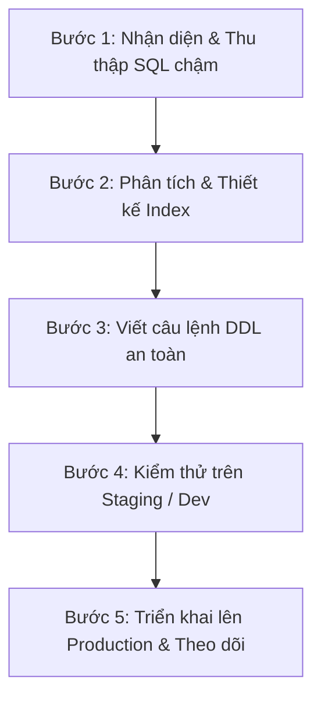

# Hướng Dẫn Quy Trình Triển Khai, Kiểm Thử & Đánh Giá Hiệu Quả Index (Oracle Database)

Tài liệu này cung cấp hướng dẫn từng bước để triển khai các chỉ mục (Index) hiệu quả, cách kiểm thử câu lệnh SQL bằng kế hoạch thực thi (Execution Plan), và cách kiểm tra xem index có hoạt động hiệu quả trên môi trường thực tế hay không.

---

## 1. Quy Trình Triển Khai Index Chuẩn (5 Bước)

Quy trình triển khai index trên hệ thống cơ sở dữ liệu (đặc biệt là môi trường Production) cần tuân thủ các bước chặt chẽ để tránh làm treo ứng dụng hoặc gây suy giảm hiệu năng ghi dữ liệu.



### 1.1 Bước 1: Nhận diện & Thu thập SQL chậm
*   **Mục tiêu**: Tìm ra các câu lệnh SQL tốn nhiều thời gian phản hồi hoặc tài nguyên CPU/IO nhất.
*   **Hành động**:
    *   **Trong ứng dụng Spring**: Bật ghi log SQL của MyBatis với thời gian thực thi (ví dụ: dùng thư viện `p6spy` hoặc log của connection pool HikariCP).
    *   **Trong Database**: Truy vấn bảng hệ thống để tìm các câu lệnh SQL chạy chậm đang được lưu trong cache:
        ```sql
        SELECT sql_text, elapsed_time/1000000 elapsed_sec, cpu_time/1000000 cpu_sec, executions
        FROM v$sql
        WHERE elapsed_time/1000000 > 1 -- Các câu lệnh chạy trên 1 giây
        ORDER BY elapsed_time DESC;
        ```

### 1.2 Bước 2: Phân tích & Thiết kế Index
*   **Mục tiêu**: Lựa chọn cột phù hợp để đánh index.
*   **Hành động**: Áp dụng quy tắc **Equality -> Sort -> Range (E-S-R)** để chọn thứ tự các cột cho Composite Index:
    1.  **Equality (`=`)**: Các cột so sánh bằng trong mệnh đề `WHERE` (Ví dụ: `USER_ID = :id`). Các cột này phải nằm đầu tiên trong index.
    2.  **Sort (`ORDER BY`)**: Các cột dùng để sắp xếp dữ liệu (Ví dụ: `CREATED_AT DESC`). Nằm ở giữa index để tránh việc Oracle phải sắp xếp sau khi lọc.
    3.  **Range (`>`, `<`, `LIKE`, `IN`)**: Các cột so sánh khoảng hoặc so sánh không bằng. Nằm ở cuối index.

### 1.3 Bước 3: Viết câu lệnh DDL an toàn
*   **Mục tiêu**: Viết lệnh tạo index mà không gây khóa bảng làm gián đoạn ứng dụng.
*   **Hành động**:
    *   Sử dụng từ khóa **`ONLINE`** trong Oracle Database. Từ khóa này giúp người dùng vẫn có thể đọc/ghi bình thường vào bảng trong lúc Oracle đang build index.
    *   Đặt tên index theo chuẩn rõ ràng: `IDX_<Tên Bảng>_<Tên Cột>`.
    ```sql
    -- Tạo index an toàn không khóa bảng (chỉ áp dụng từ bản Oracle Enterprise Edition)
    CREATE INDEX "IDX_APP_ORDERS_USER_CREATED" 
    ON "APP_ORDERS" ("USER_ID", "CREATED_AT" DESC) ONLINE;
    ```

### 1.4 Bước 4: Kiểm thử trên môi trường phụ (Staging / Dev)
*   **Hành động**: Tạo index trên môi trường Staging có lượng dữ liệu mô phỏng tương đương Production để kiểm tra xem thời gian thực thi SQL có cải thiện không.
*   > [!WARNING]
    > Tuyệt đối không tạo trực tiếp các index mới lên Production mà chưa qua kiểm thử hiệu năng và độ ổn định trên môi trường Dev/Staging.

### 1.5 Bước 5: Triển khai lên Production & Theo dõi
*   **Hành động**: Thực hiện DDL tạo index vào các khung giờ thấp điểm (ít người truy cập). Theo dõi các chỉ số tải hệ thống (CPU, RAM, Disk I/O) ngay sau khi tạo xong.

---

## 2. Phương Pháp Kiểm Thử Hiệu Năng Câu Truy Vấn (Query Testing)

Để biết một câu truy vấn có được tối ưu hóa sau khi có index hay không, ta sử dụng **Execution Plan (Kế hoạch thực thi)**.

### 2.1 Cách sinh Execution Plan trong Oracle
Trong các công cụ như DBeaver hoặc SQL Developer, bạn chỉ cần bôi đen câu lệnh SQL và nhấn phím tắt **`Ctrl + Shift + E`** (hoặc nút **Explain Plan** trên thanh công cụ).

Nếu chạy bằng SQL tay, bạn sử dụng cú pháp sau:
```sql
-- Bước 1: Yêu cầu Oracle phân tích câu truy vấn
EXPLAIN PLAN FOR
SELECT * FROM APP_ORDERS 
WHERE USER_ID = 61 
ORDER BY CREATED_AT DESC;

-- Bước 2: Hiển thị kế hoạch thực thi dưới dạng bảng trực quan
SELECT * FROM TABLE(DBMS_XPLAN.DISPLAY);
```

### 2.2 Cách đọc và phân tích Kế hoạch thực thi
Khi bảng kế hoạch thực thi hiển thị, hãy chú ý đến các thông tin cốt lõi sau:

| Tên Chỉ Số | Mô Tả | Trạng Thái Tốt | Trạng Thái Tệ |
| :--- | :--- | :--- | :--- |
| **Operation** | Thao tác quét dữ liệu | `INDEX UNIQUE SCAN` hoặc `INDEX RANGE SCAN` | `TABLE ACCESS FULL` (Quét toàn bộ bảng) |
| **Rows (Cardinality)** | Số dòng ước tính Oracle sẽ xử lý | Càng nhỏ càng tốt (đã được lọc qua index) | Gần bằng tổng số dòng của bảng |
| **Cost (%CPU)** | Chi phí CPU ước tính để chạy câu lệnh | Thấp (ví dụ: Cost từ 1 - 50) | Rất cao (lên đến hàng nghìn hoặc hàng triệu) |

#### Ví dụ về Kế hoạch thực thi TỐT (Sử dụng Index):
```text
-------------------------------------------------------------------------------------------------
| Id  | Operation                            | Name                        | Rows  | Cost (%CPU)|
-------------------------------------------------------------------------------------------------
|   0 | SELECT STATEMENT                     |                             |     5 |     2   (0)|
|   1 |  TABLE ACCESS BY INDEX ROWID BATCHED | APP_ORDERS                  |     5 |     2   (0)|
|*  2 |   INDEX RANGE SCAN                   | IDX_APP_ORDERS_USER_CREATED |     5 |     1   (0)|
-------------------------------------------------------------------------------------------------
```
*(Giải thích: Dòng số 2 cho thấy Oracle đang sử dụng `INDEX RANGE SCAN` trên index `IDX_APP_ORDERS_USER_CREATED`, chi phí Cost cực thấp chỉ bằng 2).*

#### Ví dụ về Kế hoạch thực thi TỆ (Full Table Scan):
```text
--------------------------------------------------------------------------------------
| Id  | Operation         | Name       | Rows  | Bytes | Cost (%CPU)| Time     |
--------------------------------------------------------------------------------------
|   0 | SELECT STATEMENT  |            |     5 |   510 |   420   (2)| 00:00:01 |
|*  1 |  TABLE ACCESS FULL| APP_ORDERS |     5 |   510 |   420   (2)| 00:00:01 |
--------------------------------------------------------------------------------------
```
*(Giải thích: Oracle thực hiện `TABLE ACCESS FULL` trên bảng `APP_ORDERS`, chi phí Cost nhảy vọt lên 420).*

---

## 3. Cách Kiểm Tra & Đánh Giá Hiệu Quả Của Index

Một index được tạo ra có thể làm tăng tốc độ đọc dữ liệu (SELECT), nhưng lại làm giảm tốc độ ghi dữ liệu (INSERT, UPDATE, DELETE). Do đó, cần kiểm tra tính hiệu quả định kỳ.

### 3.1 Kiểm tra trạng thái hoạt động của Index
Đảm bảo index ở trạng thái `VALID` để hệ thống có thể sử dụng:
```sql
SELECT index_name, table_name, status 
FROM user_indexes 
WHERE index_name = 'IDX_APP_ORDERS_USER_CREATED';
```
> [!NOTE]
> Nếu trạng thái (`STATUS`) là `UNUSABLE` (thường xảy ra sau khi import dữ liệu lớn hoặc phân vùng lại bảng), index đó sẽ bị vô hiệu hóa. Bạn cần chạy lệnh rebuild để khôi phục:
> `ALTER INDEX IDX_APP_ORDERS_USER_CREATED REBUILD;`

### 3.2 Giám sát tần suất sử dụng thực tế (Index Monitoring)
Để tránh các index "rác" (index được tạo ra nhưng ứng dụng không bao giờ dùng đến, gây chậm thao tác ghi dữ liệu), hãy bật giám sát sử dụng:

```sql
-- Bước 1: Bật giám sát index cụ thể
ALTER INDEX IDX_APP_ORDERS_USER_CREATED MONITORING USAGE;

-- Bước 2: Đợi ứng dụng chạy trong vòng 24h - 48h để thu thập hành vi

-- Bước 3: Kiểm tra xem index có được sử dụng hay không
SELECT index_name, monitoring, used, start_monitoring, end_monitoring 
FROM v$object_usage 
WHERE index_name = 'IDX_APP_ORDERS_USER_CREATED';
```
*   **Nếu `USED = YES`**: Index hoạt động hiệu quả, đang phục vụ cho các truy vấn của ứng dụng.
*   **Nếu `USED = NO`**: Sau thời gian giám sát dài mà vẫn là `NO`, nghĩa là index này không được dùng đến. Bạn nên xóa (`DROP`) nó đi để giải phóng tài nguyên và tăng tốc độ ghi dữ liệu.

```sql
-- Bước 4: Tắt giám sát khi đã có kết quả
ALTER INDEX IDX_APP_ORDERS_USER_CREATED NOMONITORING USAGE;
```

### 3.3 Đo lường chi phí ghi dữ liệu (DML Overhead)
Khi thêm index mới, hãy chạy thử nghiệm đo thời gian thực thi của câu lệnh `INSERT` hoặc `UPDATE` dữ liệu lớn (Batch Insert) trước và sau khi có index:
*   Nếu thời gian ghi tăng quá nhiều (ví dụ >30%), hãy xem xét giảm số lượng index trên bảng đó.
*   **Quy tắc chung**: Với các bảng giao dịch ghi liên tục (như `APP_ORDER_ITEMS`), số lượng index trên một bảng không nên vượt quá **5 chỉ mục**.

---

## 4. Công Cụ Hỗ Trợ Đính Kèm Trong Thư Mục

Để chuẩn hóa quy trình triển khai và kiểm thử, bạn có thể sử dụng trực tiếp hai tập tin tiện ích SQL đã được tạo sẵn trong thư mục `docs/sql/`:

1.  **[query_existing_indexes.sql](../sql/query_existing_indexes.sql)**:
    *   *Mục đích*: Liệt kê nhanh toàn bộ các index hiện có trong schema của bạn, phân tích thứ tự các cột và tự động phát hiện các khóa ngoại (Foreign Keys) đang bị thiếu chỉ mục dẫn đến nguy cơ deadlock khi cập nhật/xóa bảng cha.
2.  **[check_execution_plans.sql](../sql/check_execution_plans.sql)**:
    *   *Mục đích*: Cung cấp các câu lệnh `EXPLAIN PLAN FOR` lập sẵn cho 5 câu truy vấn nghiệp vụ chính của ứng dụng. Bạn chỉ cần chạy các câu lệnh này trong công cụ cơ sở dữ liệu để kiểm chứng ngay lập tức xem hệ quản trị Oracle có thực sự sử dụng các Performance Index mà chúng ta vừa triển khai hay không.

