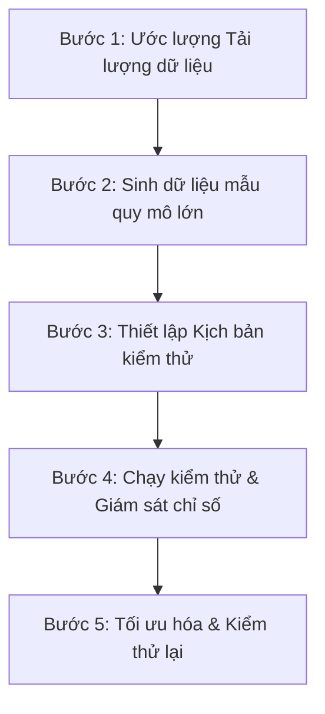

# Quy Trình Kiểm Thử Hiệu Năng & Tải Trọng Cơ Sở Dữ Liệu (Database Performance & Load Testing)

Báo cáo này hướng dẫn chi tiết quy trình chuẩn để thực hiện kiểm thử hiệu năng cơ sở dữ liệu (Database Testing) với lượng dữ liệu giả lập (Mock Data) lớn, nhằm đảm bảo hệ thống hoạt động ổn định khi đưa vào môi trường Production.

---

## 1. Tại Sao Phải Kiểm Thử Cơ Sở Dữ Liệu Với Dữ Liệu Lớn?

Trong giai đoạn phát triển, mã nguồn thường chỉ được chạy thử với vài chục bản ghi dữ liệu mẫu. Điều này che giấu toàn bộ các vấn đề nghiêm trọng như:
*   **Quét toàn bộ bảng (Full Table Scan)**: Chạy dưới 1ms với 10 dòng, nhưng mất vài chục giây với 1 triệu dòng.
*   **Tranh chấp tài nguyên & Khóa chết (Locks & Deadlocks)**: Xảy ra khi hàng trăm người dùng cùng ghi dữ liệu vào các bảng không được lập chỉ mục khóa ngoại tối ưu.
*   **Tràn bộ nhớ đệm / Nghẽn đĩa cứng (I/O Bottleneck)**: Hệ thống đĩa cứng (HDD/SSD) không kịp đáp ứng số lượng yêu cầu đọc/ghi (IOPS) tăng vọt.

---

## 2. Quy Trình Kiểm Thử DB Chuẩn Thực Tế (5 Bước)



### Bước 1: Lập kế hoạch & Ước lượng tải (Planning)
Nhóm phát triển và quản trị hệ thống phối hợp để xác định:
*   **Dung lượng tích lũy**: Ước tính số dòng dữ liệu sinh ra sau 1 năm, 3 năm hoạt động của các bảng chính (Ví dụ: `APP_USERS` có 100k dòng, `APP_ORDERS` có 1 triệu dòng).
*   **Chỉ số CCU (Concurrent Users)**: Số lượng người dùng truy cập đồng thời vào giờ cao điểm (Ví dụ: 500 CCU, 1,000 CCU).

### Bước 2: Sinh dữ liệu giả lập quy mô lớn (Data Seeding)
*   Sử dụng các công cụ sinh dữ liệu hoặc viết các hàm chạy vòng lặp (PL/SQL) trực tiếp trên database để nhét lượng dữ liệu tương đương 1-3 năm chạy thật vào môi trường kiểm thử (Staging/UAT).
*   *Lưu ý*: Dữ liệu mock cần có tính ngẫu nhiên và phân phối thực tế (ví dụ: các khóa ngoại phải liên kết chính xác đến các khóa chính hiện có).

### Bước 3: Thiết lập kịch bản kiểm thử (Test Scenario)
*   **Kịch bản Đọc nhiều (Read-Heavy)**: Giả lập người dùng tìm kiếm sản phẩm, xem lịch sử đơn hàng.
*   **Kịch bản Ghi nhiều (Write-Heavy)**: Giả lập hàng loạt người dùng thêm sản phẩm vào giỏ hàng, thực hiện thanh toán và chèn đơn hàng mới.
*   **Kịch bản Hỗn hợp (Mixed Load)**: Giả lập 80% tác vụ đọc và 20% tác vụ ghi (đây là kịch bản sát thực tế nhất).

### Bước 4: Thực thi kiểm thử và Giám sát chỉ số (Execution & Monitoring)
Sử dụng các công cụ tạo tải (như **Apache JMeter**, **K6**, **Gatling**) để gửi hàng loạt yêu cầu đồng thời vào ứng dụng Spring. Trong lúc đó, giám sát các chỉ số sau trên database:
*   **CPU & RAM Utilization**: Kiểm tra CPU database server có bị đẩy lên 100% hay không.
*   **Disk I/O (IOPS, Read/Write throughput)**: Tốc độ đọc ghi của đĩa cứng.
*   **Active Sessions**: Số lượng kết nối đang hoạt động đồng thời.
*   **Locks and Waits**: Xem các câu lệnh có bị chờ nhau (Lock Wait) hoặc xảy ra lỗi Deadlock (`ORA-00060`) hay không.

### Bước 5: Tối ưu hóa & Tái kiểm thử (Optimization & Re-testing)
*   Dựa trên các câu SQL chạy chậm nhất thu được từ log hệ thống hoặc công cụ giám sát, tiến hành tối ưu hóa: đánh thêm index, tối ưu lại câu truy vấn, tăng kích thước Connection Pool trong Spring (`HikariCP`), hoặc nâng cấp cấu hình phần cứng database.
*   Chạy lại toàn bộ kịch bản kiểm thử ở Bước 4 để so sánh các chỉ số trước và sau khi tối ưu.

---

## 3. Tiện Ích: Script Sinh Dữ Liệu Lớn Tốc Độ Cao Trên Oracle

Để hỗ trợ bạn kiểm thử, dưới đây là đoạn script PL/SQL mẫu giúp chèn nhanh **100,000 dòng dữ liệu** vào bảng `APP_USERS` và `APP_ORDERS` trên Oracle Database chỉ trong vài giây bằng cách sử dụng cơ chế **Bulk Insert (FORALL)** để giảm thiểu chi phí chuyển đổi ngữ cảnh (Context Switching).

```sql
DECLARE
  TYPE t_user_id IS TABLE OF NUMBER;
  v_user_ids t_user_id := t_user_id();
  
  v_batch_size CONSTANT NUMBER := 10000; -- Mỗi đợt chèn 10,000 dòng
  v_total_users CONSTANT NUMBER := 100000; -- Tổng số 100,000 users
  v_start_seq NUMBER;
BEGIN
  DBMS_OUTPUT.PUT_LINE('Bắt đầu chèn dữ liệu giả lập...');
  
  -- Lấy giá trị sequence hiện tại
  SELECT APP_USER_SEQ.NEXTVAL INTO v_start_seq FROM dual;
  
  FOR i IN 1..(v_total_users / v_batch_size) LOOP
    -- 1. Chèn Bulk Insert vào bảng APP_USERS
    FORALL j IN 1..v_batch_size
      INSERT INTO "APP_USERS" (
        "ID", "USERNAME", "PASSWORD", "EMAIL", "FULL_NAME", 
        "PHONE", "ROLE", "STATUS", "CREATED_AT", "UPDATED_AT"
      ) VALUES (
        v_start_seq + ((i-1) * v_batch_size) + j,
        'user_' || (v_start_seq + ((i-1) * v_batch_size) + j),
        '$2a$12$eX8075YvW4P2o6M0YxZ5e.tP7UqY5r6xQWk3A1X1lD5t1', -- Mật khẩu mã hóa sẵn
        'user_' || (v_start_seq + ((i-1) * v_batch_size) + j) || '@test.com',
        'Mock User ' || (v_start_seq + ((i-1) * v_batch_size) + j),
        '091234' || LPAD(j, 4, '0'),
        'USER',
        'ACTIVE',
        SYSTIMESTAMP - DBMS_RANDOM.VALUE(1, 100), -- Ngày tạo ngẫu nhiên trong 100 ngày qua
        SYSTIMESTAMP
      );
    
    COMMIT; -- Commit sau mỗi batch để giải phóng log buffer
  END LOOP;
  
  -- Cập nhật lại giá trị hiện tại của SEQUENCE để không bị lỗi trùng lặp ID khi ứng dụng Java chạy
  EXECUTE IMMEDIATE 'ALTER SEQUENCE APP_USER_SEQ RESTART WITH ' || (v_start_seq + v_total_users + 1);
  
  -- Thu thập lại thống kê để Oracle cập nhật số lượng dòng mới chèn vào
  DBMS_STATS.GATHER_TABLE_STATS(USER, 'APP_USERS');
  
  DBMS_OUTPUT.PUT_LINE('Đã chèn thành công ' || v_total_users || ' users và cập nhật thống kê.');
EXCEPTION
  WHEN OTHERS THEN
    ROLLBACK;
    DBMS_OUTPUT.PUT_LINE('Gặp lỗi: ' || SQLERRM);
END;
/
```

---

## 4. Các Chỉ Số Cần Đạt Được Sau Khi Tối Ưu Hóa

Hệ thống database sau khi được tối ưu bằng index và cấu hình tốt cần đạt các tiêu chí sau dưới tải lớn:

| Chỉ số kiểm thử | Mức tốt (Đã tối ưu) | Mức chưa tốt (Chưa tối ưu) |
| :--- | :--- | :--- |
| **Thời gian phản hồi SQL (SELECT)** | < 10 ms | > 500 ms (gây nghẽn API) |
| **Tỷ lệ sử dụng CPU của Database** | < 70% | Thường xuyên chạm 100% |
| **Số lượng khóa chờ (Lock Waits)** | Gần như bằng 0 | Lớn (các câu lệnh bị xếp hàng chờ nhau) |
| **Lỗi khóa chết (Deadlocks)** | Không xảy ra | Thường xuyên xuất hiện trong log |
