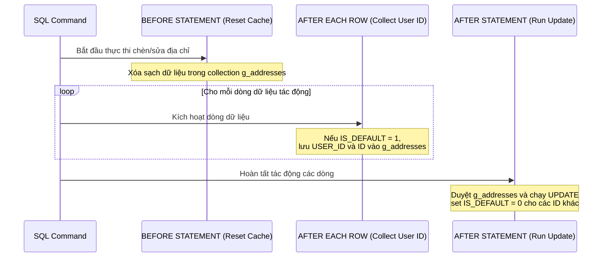

# Database Triggers - Lý thuyết & Hướng dẫn Triển khai (Oracle DB)

Tài liệu này cung cấp cái nhìn toàn diện về **Database Trigger** (Trình kích hoạt cơ sở dữ liệu), các thách thức kỹ thuật (như lỗi Mutating Table), cách phân tích thiết kế, và chi tiết triển khai hai trigger mẫu vừa tạo trong dự án.

---

## 1. Tổng quan về Database Trigger

### 1.1. Trigger là gì?
Trigger là một khối code PL/SQL được đặt tên, được lưu trữ trong cơ sở dữ liệu và **tự động thực thi (kích hoạt)** khi một sự kiện cụ thể xảy ra. Sự kiện này thường là các thao tác DML (Data Manipulation Language) bao gồm: `INSERT`, `UPDATE`, hoặc `DELETE`.

### 1.2. Phân loại theo Thời điểm kích hoạt (Timing)
*   **BEFORE:** Thực thi trước khi hành động DML được áp dụng vào bảng. Thường dùng để chuẩn hóa dữ liệu, gán giá trị mặc định, hoặc kiểm tra tính hợp lệ dữ liệu.
*   **AFTER:** Thực thi sau khi hành động DML đã hoàn tất. Thường dùng để cập nhật bảng khác, đồng bộ dữ liệu, ghi log audit hoặc gửi thông báo.
*   **INSTEAD OF:** Dùng trên các Views không thể cập nhật trực tiếp để thay thế hành động DML gốc bằng logic tùy chỉnh.

### 1.3. Phân loại theo Phạm vi ảnh hưởng (Level)
*   **FOR EACH ROW (Row-level):** Kích hoạt **mỗi lần cho từng dòng** bị tác động bởi câu lệnh SQL. Trong row-level trigger, ta có thể sử dụng biến giả lập `:OLD` và `:NEW` để truy cập giá trị trước và sau khi thay đổi.
*   **Statement-level (Mặc định):** Kích hoạt **đúng một lần** cho mỗi câu lệnh SQL, bất kể câu lệnh đó tác động đến 0, 1 hay hàng triệu dòng. Không thể sử dụng `:OLD` và `:NEW`.

### 1.4. Cấu trúc cú pháp định nghĩa Trigger chung (Oracle Syntax)
Dưới đây là cú pháp tổng quát để định nghĩa một Trigger trong Oracle Database:

```sql
CREATE OR REPLACE TRIGGER name_of_trigger
{BEFORE | AFTER | INSTEAD OF} {INSERT | UPDATE | DELETE [OF column_name]}
ON table_name
[REFERENCING OLD AS old NEW AS new]
[FOR EACH ROW]
[WHEN (condition)]
DECLARE
    -- Khai báo các biến tạm thời, cursors, hoặc hằng số (nếu có)
BEGIN
    -- Khối lệnh logic xử lý PL/SQL chính
EXCEPTION
    -- Khối bắt lỗi và xử lý ngoại lệ (nếu có)
END;
/
```

**Giải thích các thành phần chính:**
*   `CREATE OR REPLACE TRIGGER`: Định nghĩa hoặc ghi đè (nếu đã tồn tại) một trigger.
*   `{BEFORE | AFTER | INSTEAD OF}`: Thời điểm kích hoạt trigger so với hành động DML.
*   `{INSERT | UPDATE | DELETE [OF column_name]}`: Sự kiện kích hoạt. Bạn có thể kết hợp nhiều sự kiện bằng từ khóa `OR` (ví dụ: `INSERT OR UPDATE OF STATUS`).
*   `ON table_name`: Chỉ định bảng (hoặc view) chịu tác động.
*   `[FOR EACH ROW]`: Nếu có từ khóa này, trigger sẽ là **Row-level** (chạy cho từng dòng). Nếu bỏ qua, mặc định sẽ là **Statement-level** (chạy một lần duy nhất cho cả câu lệnh).
*   `[WHEN (condition)]`: Bộ lọc điều kiện bổ sung ở mức dòng. Trigger chỉ thực thi khi điều kiện này trả về `TRUE` (rất tốt cho hiệu năng).

---

## 2. Các biến giả lập `:OLD` và `:NEW` trong Oracle
Các biến này đại diện cho dữ liệu của dòng hiện tại đang bị tác động:

| Trạng thái | `:OLD` | `:NEW` |
| :--- | :--- | :--- |
| **INSERT** | Tất cả các cột đều là `NULL` | Chứa giá trị chuẩn bị được chèn |
| **UPDATE** | Chứa giá trị của cột trước khi sửa | Chứa giá trị mới chuẩn bị cập nhật |
| **DELETE** | Chứa giá trị trước khi bị xóa | Tất cả các cột đều là `NULL` |

---

## 3. Thách thức lớn nhất: Lỗi Mutating Table (ORA-04091)

### 3.1. Nguyên nhân lỗi
Trong Oracle, khi một **Row-level Trigger** (được khai báo có `FOR EACH ROW`) cố gắng đọc (`SELECT`) hoặc chỉnh sửa (`UPDATE`, `DELETE`) chính cái bảng đang kích hoạt trigger đó, Oracle sẽ lập tức ném ra lỗi:
```text
ORA-04091: table SCHEMA.TABLE_NAME is mutating, trigger/function may not see it
```
Điều này nhằm ngăn chặn tình trạng dữ liệu mâu thuẫn (như đọc dữ liệu chưa hoàn tất giao dịch hoặc gây ra vòng lặp vô hạn).

### 3.2. Giải pháp giải quyết
1.  **Dùng Compound Trigger (Oracle 11g+):** Cho phép kết hợp các khối timing (Before/After Statement, Before/After Row) trong cùng một Trigger. Chúng ta có thể dùng biến toàn cục tạm thời trong Trigger để thu thập dữ liệu ở Row-level, rồi xử lý ở Statement-level (nơi bảng không còn bị khóa/mutating).
2.  **Sử dụng Table tạm (Global Temporary Table - GTT):** Lưu các ID cần xử lý vào bảng tạm, sau đó dùng thủ tục để xử lý. (Phức tạp hơn, không khuyến khích).

---

## 4. Phân tích & Triển khai trong Dự án

Dự án hiện tại đã áp dụng 2 nhóm trigger được định nghĩa tại file [V5__add_triggers.sql](../../src/main/resources/db/migration/V5__add_triggers.sql):

### 4.1. Nhóm Trigger tự động cập nhật `UPDATED_AT` (Row-level BEFORE UPDATE)

#### Phân tích thiết kế:
*   **Mục tiêu:** Tự động set thời gian cập nhật bản ghi mà không phụ thuộc vào code Java.
*   **Thiết kế:** Dùng `BEFORE UPDATE` và `FOR EACH ROW` để can thiệp trực tiếp vào giá trị `:NEW.UPDATED_AT` trước khi lưu xuống đĩa.

#### Mã nguồn triển khai:
```sql
CREATE OR REPLACE TRIGGER "TRG_PRODUCTS_UPDATED_AT"
BEFORE UPDATE ON "APP_PRODUCTS"
FOR EACH ROW
BEGIN
    :NEW."UPDATED_AT" := SYSTIMESTAMP;
END;
/
```
*(Cơ chế tương tự được áp dụng cho các bảng `APP_USERS`, `APP_CATEGORIES`, `APP_ORDERS`, và `APP_EXCEL_TASKS`).*

---

### 4.2. Trigger quản lý Địa chỉ mặc định (Compound Trigger)

#### Phân tích thiết kế:
*   **Mục tiêu:** Khi một địa chỉ được sửa/thêm mới với `IS_DEFAULT = 1`, toàn bộ địa chỉ khác của user đó phải được chuyển về `IS_DEFAULT = 0`.
*   **Thách thức:** Nếu dùng Trigger row-level thông thường và thực hiện câu lệnh `UPDATE APP_USER_ADDRESSES ...`, hệ thống sẽ báo lỗi `ORA-04091 (Mutating Table)` vì ta đang update chính bảng đang bị trigger.
*   **Giải pháp:** Áp dụng **Compound Trigger** để lưu trữ ID của user có địa chỉ mặc định mới trong danh sách tạm thời ở pha `AFTER EACH ROW`, và thực hiện lệnh update ở pha `AFTER STATEMENT` (khi bảng đã thoát trạng thái mutating).

#### Luồng hoạt động của Compound Trigger:


#### Mã nguồn triển khai:
```sql
CREATE OR REPLACE TRIGGER "TRG_USER_ADDRESS_DEFAULT"
FOR INSERT OR UPDATE OF "IS_DEFAULT" ON "APP_USER_ADDRESSES"
COMPOUND TRIGGER

    -- Định nghĩa cấu trúc lưu trữ tạm thời
    TYPE t_address_rec IS RECORD (
        user_id     "APP_USER_ADDRESSES"."USER_ID"%TYPE,
        address_id  "APP_USER_ADDRESSES"."ID"%TYPE
    );
    TYPE t_addresses IS TABLE OF t_address_rec INDEX BY PLS_INTEGER;
    g_addresses  t_addresses;
    g_count      PLS_INTEGER := 0;

    -- Khởi tạo biến lưu trữ khi câu lệnh SQL bắt đầu chạy
    BEFORE STATEMENT IS
    BEGIN
        g_addresses.DELETE;
        g_count := 0;
    END BEFORE STATEMENT;

    -- Gom góp thông tin các bản ghi có sự thay đổi IS_DEFAULT = 1
    AFTER EACH ROW IS
    BEGIN
        IF :NEW."IS_DEFAULT" = 1 THEN
            g_count := g_count + 1;
            g_addresses(g_count).user_id := :NEW."USER_ID";
            g_addresses(g_count).address_id := :NEW."ID";
        END IF;
    END AFTER EACH ROW;

    -- Xử lý đồng loạt sau khi câu lệnh SQL đã chạy xong hoàn toàn
    AFTER STATEMENT IS
    BEGIN
        IF g_count > 0 THEN
            FOR i IN 1..g_count LOOP
                UPDATE "APP_USER_ADDRESSES"
                SET "IS_DEFAULT" = 0
                WHERE "USER_ID" = g_addresses(i).user_id
                  AND "ID" <> g_addresses(i).address_id
                  AND "IS_DEFAULT" = 1;
            END LOOP;
        END IF;
    END AFTER STATEMENT;
END;
/
```

---

## 5. Quy tắc Thiết kế & Sử dụng Trigger Tốt (Best Practices)

1.  **Chỉ dùng khi thực sự cần thiết:** Không lạm dụng Trigger để xử lý logic nghiệp vụ phức tạp của ứng dụng (Business Logic nên thuộc về tầng Java Service). Chỉ dùng cho việc đồng bộ dữ liệu, bảo toàn toàn vẹn dữ liệu tầng thấp, hoặc audit log.
2.  **Giữ cho Trigger thật ngắn gọn:** Tránh các câu truy vấn phức tạp hoặc xử lý chậm bên trong trigger, vì nó sẽ kéo dài thời gian khóa dòng dữ liệu, làm giảm hiệu năng hệ thống.
3.  **Tránh Trigger dây chuyền (Cascading Triggers):** Thiết kế cẩn thận để tránh việc Trigger bảng A cập nhật bảng B, Trigger bảng B lại quay lại cập nhật bảng A dẫn đến vòng lặp vô hạn hoặc deadlock.
4.  **Tài liệu hóa rõ ràng:** Trigger chạy ngầm dưới Database nên thường khó debug khi xảy ra lỗi. Mọi trigger tạo ra cần được lưu trữ trong mã nguồn quản lý phiên bản database (như Flyway migration) và ghi chép tài liệu rõ ràng.

---

## 6. Hướng dẫn Tối ưu & Đồng bộ hóa Code Java/MyBatis

Sau khi triển khai các trigger trên, chúng ta cần rà soát và tối ưu lại code Java/MyBatis như sau:

### 6.1. Đối với nhóm Trigger `UPDATED_AT`
Chúng ta có thể loại bỏ việc cập nhật thủ công trường `UPDATED_AT` trong các file XML Mapper của MyBatis để câu lệnh SQL sạch sẽ hơn:

*   **Các file XML Mapper có thể tối ưu:**
    *   `UserCommandMapper.xml`
    *   `CategoryMapper.xml`
    *   `ProductMapper.xml`
    *   `OrderMapper.xml`
    *   `ExcelTaskMapper.xml`
*   **Ví dụ tối ưu trong `UserCommandMapper.xml`:**
    ```diff
     <update id="update" parameterType="...">
         UPDATE APP_USERS
         SET
             USERNAME = #{username, jdbcType=VARCHAR},
             FULL_NAME = #{fullName, jdbcType=VARCHAR},
             EMAIL = #{email, jdbcType=VARCHAR},
             PHONE = #{phone, jdbcType=VARCHAR},
             STATUS = #{status, jdbcType=VARCHAR},
             PASSWORD = #{password, jdbcType=VARCHAR},
-            ROLE = #{role, jdbcType=VARCHAR},
-            UPDATED_AT = SYSTIMESTAMP
+            ROLE = #{role, jdbcType=VARCHAR}
         WHERE ID = #{id, jdbcType=NUMERIC}
     </update>
    ```
    *(Trigger `TRG_USERS_UPDATED_AT` sẽ tự động điền `UPDATED_AT` bằng `SYSTIMESTAMP` dưới database khi câu lệnh UPDATE chạy).*

### 6.2. Đối với Trigger địa chỉ mặc định (`TRG_USER_ADDRESS_DEFAULT`)

#### A. Đánh giá mã nguồn Java hiện tại:
*   Trong `User.java` (Domain Model), phương thức `addAddress()` đang thực hiện duyệt danh sách địa chỉ trong bộ nhớ RAM và set `isDefault(false)` cho các địa chỉ cũ để đảm bảo tính nhất quán (in-memory consistency) trước khi lưu.
*   Trong `UserAddressController.java` (Presentation), luồng xử lý thêm/xóa địa chỉ đang sử dụng mô hình **PRG (Post-Redirect-Get)**: Sau khi POST (lưu địa chỉ), trình duyệt sẽ thực hiện lệnh Redirect về trang danh sách (`GET /users/addresses`).

#### B. Khuyến nghị hành động:
1.  **Giữ nguyên logic in-memory của Domain Model (`User.java`):** 
    Mặc dù Database Trigger đã tự động hóa việc này dưới DB, việc giữ lại logic set `isDefault(false)` trong class Java `User` vẫn rất tốt. Nó giúp đảm bảo tính nhất quán của Aggregate Root ngay trong bộ nhớ trước khi lưu và bảo vệ các Business Rules của ứng dụng.
2.  **Đồng bộ hóa giao diện hiển thị:**
    Nhờ cấu hình `mybatis.cache-enabled=false` trong `application.properties`, mọi truy vấn đọc danh sách địa chỉ (sau khi chuyển hướng GET) sẽ chọc thẳng xuống Database để lấy dữ liệu tươi mới nhất vừa được xử lý bởi Trigger. **Chúng ta không cần sửa đổi thêm bất cứ logic nào ở Controller hay Service**.
3.  **Lưu ý khi mở rộng API JSON:**
    Nếu sau này bạn phát triển API REST trả trực tiếp đối tượng địa chỉ vừa tạo dưới dạng JSON, hãy đảm bảo query lại database:
    ```java
    // Tránh trả về trực tiếp đối tượng Java cũ:
    // return newAddress; 

    // Nên SELECT lại từ Database để lấy dữ liệu đã qua Trigger:
    return addressQueryPort.findById(newAddress.getId());
    ```

