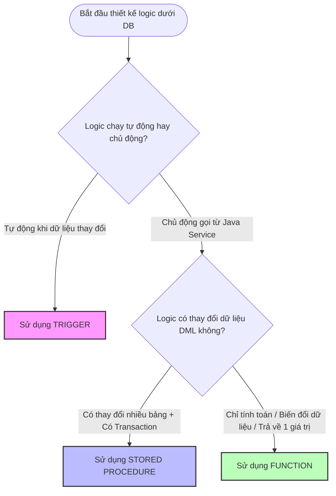

# Báo Cáo So Sánh Chi Tiết: Trigger, Stored Procedure và Function (Oracle DB)

Tài liệu này cung cấp bảng so sánh đa chiều và phân tích chuyên sâu về ba thành phần lập trình cốt lõi trong Oracle Database: **Trigger**, **Stored Procedure**, và **Function**. Mục tiêu là giúp đội ngũ phát triển đưa ra quyết định thiết kế chính xác khi triển khai các nghiệp vụ hệ thống.

---

## 1. Bảng So Sánh Tổng Hợp Đa Chiều

| Tiêu Chí So Sánh | Trigger (Trình kích hoạt) | Stored Procedure (Thủ tục) | Function (Hàm) |
| :--- | :--- | :--- | :--- |
| **Định nghĩa** | Khối mã chạy ngầm tự động để phản hồi một sự kiện xảy ra trên bảng. | Khối mã độc lập thực thi một chuỗi logic nghiệp vụ phức tạp. | Khối mã độc lập tính toán và trả về duy nhất một giá trị. |
| **Cách kích hoạt** | **Tự động (Implicit):** Kích hoạt bởi sự kiện DML (`INSERT`, `UPDATE`, `DELETE`) hoặc sự kiện hệ thống. | **Tường minh (Explicit):** Gọi bằng lệnh `EXECUTE` hoặc `{call ...}` từ Java/MyBatis. | **Lồng trong biểu thức:** Gọi trực tiếp trong SQL (`SELECT`, `WHERE`) hoặc khối PL/SQL khác. |
| **Giá trị trả về** | **Không có:** Không thể sử dụng từ khóa `RETURN` để trả về giá trị (chỉ dùng `RETURN` để thoát sớm). | **Không trực tiếp:** Trả kết quả gián tiếp thông qua các tham số đầu ra (`OUT`, `IN OUT`). | **Bắt buộc:** Phải trả về đúng 1 giá trị thông qua mệnh đề `RETURN return_type`. |
| **Sử dụng trong SQL** | Không thể gọi trong câu lệnh SQL. | Không thể gọi trong câu lệnh SQL. | **Có thể gọi trực tiếp** (ví dụ: `SELECT FUNC_ABC(col) FROM table`). |
| **Quản lý Transaction** | **Không cho phép:** Không được chứa `COMMIT` hoặc `ROLLBACK` (trừ khi dùng `Autonomous Transaction`). | **Cho phép hoàn toàn:** Có toàn quyền kiểm soát giao dịch (`COMMIT`/`ROLLBACK`). | **Hạn chế:** Không được chạy `COMMIT`/`ROLLBACK` nếu hàm được nhúng trong câu lệnh SQL `SELECT`. |
| **Thao tác DML** | Cho phép chỉnh sửa bảng hiện tại (trước khi lưu) hoặc các bảng liên quan khác. | Cho phép thực thi tất cả các câu lệnh DML (`INSERT`, `UPDATE`, `DELETE`) tùy ý. | **Hạn chế:** Không được thực thi DML trên các bảng khác nếu hàm được nhúng trong SQL `SELECT`. |
| **Tham số truyền vào** | **Không có:** Tham số được nhận gián tiếp qua các biến hệ thống `:OLD` và `:NEW`. | Có đầy đủ các tham số truyền vào/ra (`IN`, `OUT`, `IN OUT`). | Hầu như chỉ sử dụng tham số `IN` (hạn chế tối đa việc dùng `OUT` để đảm bảo tính thuần khiết của hàm). |
| **Hiệu năng & Khóa** | Có thể làm chậm giao dịch nếu xử lý lâu vì nó chạy trên cùng transaction của câu lệnh DML gốc. | Hiệu năng rất cao vì giảm thiểu Network Roundtrip giữa Java và Database. | Rất nhanh, có thể sử dụng từ khóa `DETERMINISTIC` để database cache lại kết quả tính toán. |

---

## 2. Phân Tích Chuyên Sâu Từng Thành Phần

### 2.1. Trigger (Trình kích hoạt) - Người gác cổng dữ liệu
Trigger là cơ chế phản ứng thụ động của cơ sở dữ liệu. Nó được gắn chặt với vòng đời của các dòng dữ liệu.

*   **Cơ chế hoạt động:** Chạy trong cùng một Transaction với câu lệnh DML kích hoạt nó. Nếu Trigger bị lỗi và ném ra Exception, toàn bộ câu lệnh SQL gốc (và cả Transaction đó) sẽ bị **ROLLBACK**.
*   **Khi nào nên dùng:**
    *   Tự động điền dữ liệu kỹ thuật như `UPDATED_AT = SYSTIMESTAMP` hoặc sinh ID tự động từ Sequence.
    *   Ràng buộc toàn vẹn dữ liệu ở mức vật lý (ví dụ: đảm bảo chỉ có tối đa 1 địa chỉ mặc định).
    *   Ghi lịch sử thay đổi dữ liệu (Audit Trail/Logging) sang bảng Log khi có hành động chỉnh sửa hoặc xóa dữ liệu nhạy cảm.

### 2.2. Stored Procedure (Thủ tục) - Động cơ xử lý nghiệp vụ nặng
Procedure là tập hợp các xử lý chủ động. Nó thường đại diện cho một chức năng nghiệp vụ (Business Feature) hoàn chỉnh.

*   **Cơ chế hoạt động:** Chạy theo yêu cầu gọi từ tầng ứng dụng. Nó có thể kết hợp nhiều câu lệnh SQL phức tạp, thực hiện tính toán, kiểm tra điều kiện, ghi nhận thay đổi và kết thúc bằng việc lưu (`COMMIT`) hoặc hủy bỏ (`ROLLBACK`).
*   **Khi nào nên dùng:**
    *   Các nghiệp vụ yêu cầu tính nguyên tử (Atomicity) cao và liên quan đến nhiều bảng (ví dụ: Đặt hàng - gồm kiểm tra kho sản phẩm $\rightarrow$ khóa dòng $\rightarrow$ trừ kho $\rightarrow$ tạo đơn hàng $\rightarrow$ ghi chi tiết đơn hàng).
    *   Xử lý hàng loạt (Batch Processing) dữ liệu lớn định kỳ cuối ngày/cuối tháng trực tiếp dưới DB để tránh kéo hàng triệu bản ghi lên Java RAM.

### 2.3. Function (Hàm) - Công cụ tính toán và biến đổi
Function được thiết kế với tư duy hướng biểu thức. Nhiệm vụ chính của nó là nhận đầu vào, biến đổi hoặc tính toán và trả về kết quả.

*   **Cơ chế hoạt động:** Hoạt động giống như các hàm tiện ích (`Utility Methods`) trong Java. Nó có thể được gọi lồng ngay trong câu lệnh `SELECT` giúp dữ liệu được định dạng hoặc tính toán xong xuôi trước khi trả về cho MyBatis/Java.
*   **Khi nào nên dùng:**
    *   Tính toán các chỉ số động (ví dụ: Tính tổng chi tiêu tích lũy của khách hàng, tính thuế VAT của sản phẩm).
    *   Chuẩn hóa và định dạng dữ liệu (ví dụ: Ghép địa chỉ chi tiết thành địa chỉ đầy đủ, ẩn thông tin nhạy cảm của email/số điện thoại bằng ký tự `*`).

---

## 3. Kịch Bản Thực Tế & Định Hướng Áp Dụng Trong Dự Án E-Commerce

Dưới đây là sơ đồ tư duy giúp bạn chọn đúng công cụ khi thiết kế tính năng:

### Ví dụ phân bổ thực tế trong dự án của bạn:
1.  **Cập nhật thời gian sửa đổi sản phẩm:** $\rightarrow$ Dùng **Trigger** `TRG_PRODUCTS_UPDATED_AT` (Tự động chạy ngầm khi Admin bấm update sản phẩm).
2.  **Khách hàng bấm nút thanh toán đơn hàng:** $\rightarrow$ Dùng **Stored Procedure` `PROC_CREATE_ORDER` (Thao tác phức tạp, ảnh hưởng đến kho hàng, giỏ hàng, cần đảm bảo ACID).
3.  **Hiển thị tổng số tiền tích lũy của User trên giao diện:** $\rightarrow$ Dùng **Function** `FUNC_CALC_USER_TOTAL_SPENT` (Nhúng trực tiếp vào câu lệnh `SELECT` thông tin User).
